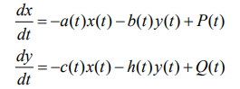
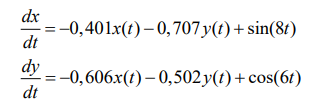
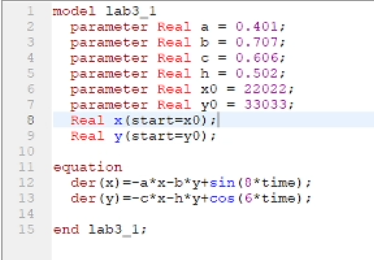
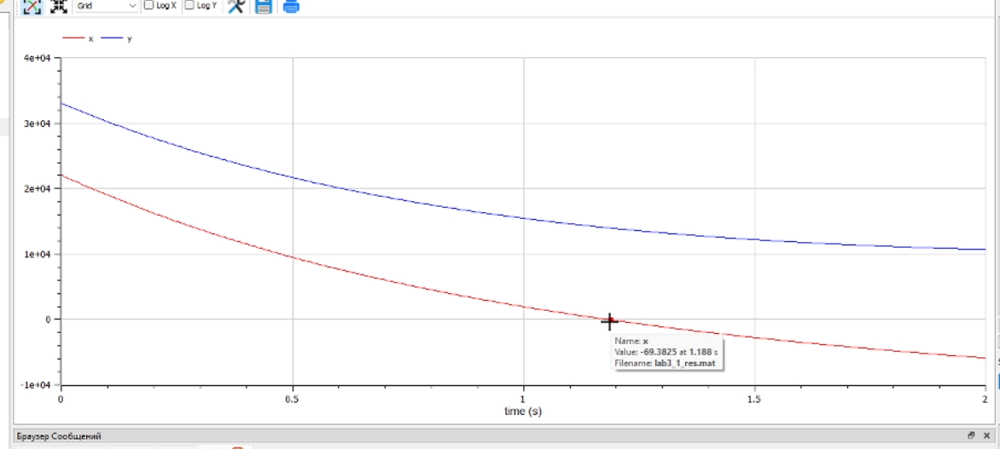
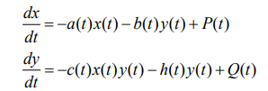
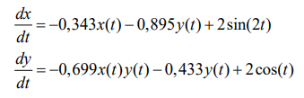
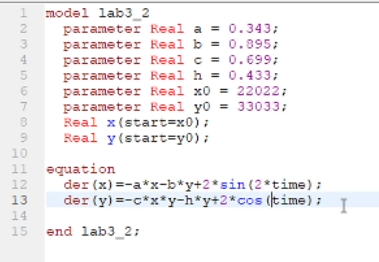
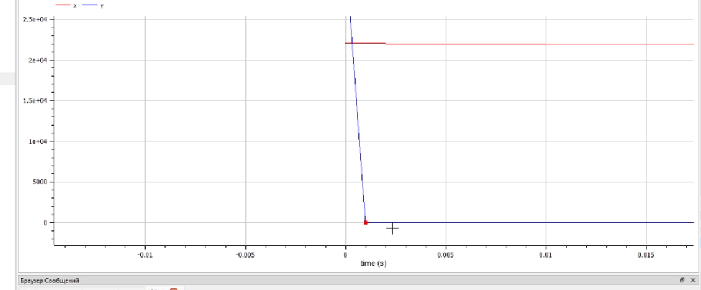

---
# Front matter
title: "Презентация о выполнении лабораторной работы №3"
subtitle: "Построение математической модели боевых действий"
author: "Терентьев Егор Дмитриевич"
group: "НФИбд-03-19"
institute: "Российский Университет Дружбы Народов, Москва, Россия"
teacher: "Дмитрий Сергеевич Кулябов"
date: "26.02.2022"

# Generic options
lang: ru-RU
toc-title: "Содержание"

# Bibliography
bibliography: bib/cite.bib
csl: pandoc/csl/gost-r-7-0-5-2008-numeric.csl

# Pdf output format
toc: true # Table of contents
toc_depth: 2
lof: true # List of figures
lot: true # List of tables
fontsize: 12pt
linestretch: 1.5
papersize: a4
documentclass: scrreprt
## I18n
polyglossia-lang:
  name: russian
  options:
	- spelling=modern
	- babelshorthands=true
polyglossia-otherlangs:
  name: english
### Fonts
mainfont: PT Serif
romanfont: PT Serif
sansfont: PT Sans
monofont: PT Mono
mainfontoptions: Ligatures=TeX
romanfontoptions: Ligatures=TeX
sansfontoptions: Ligatures=TeX,Scale=MatchLowercase
monofontoptions: Scale=MatchLowercase,Scale=0.9
## Biblatex
biblatex: true
biblio-style: "gost-numeric"
biblatexoptions:
  - parentracker=true
  - backend=biber
  - hyperref=auto
  - language=auto
  - autolang=other*
  - citestyle=gost-numeric
## Misc options
indent: true
header-includes:
  - \linepenalty=10 # the penalty added to the badness of each line within a paragraph (no associated penalty node) Increasing the value makes tex try to have fewer lines in the paragraph.
  - \interlinepenalty=0 # value of the penalty (node) added after each line of a paragraph.
  - \hyphenpenalty=50 # the penalty for line breaking at an automatically inserted hyphen
  - \exhyphenpenalty=50 # the penalty for line breaking at an explicit hyphen
  - \binoppenalty=700 # the penalty for breaking a line at a binary operator
  - \relpenalty=500 # the penalty for breaking a line at a relation
  - \clubpenalty=150 # extra penalty for breaking after first line of a paragraph
  - \widowpenalty=150 # extra penalty for breaking before last line of a paragraph
  - \displaywidowpenalty=50 # extra penalty for breaking before last line before a display math
  - \brokenpenalty=100 # extra penalty for page breaking after a hyphenated line
  - \predisplaypenalty=10000 # penalty for breaking before a display
  - \postdisplaypenalty=0 # penalty for breaking after a display
  - \floatingpenalty = 20000 # penalty for splitting an insertion (can only be split footnote in standard LaTeX)
  - \raggedbottom # or \flushbottom
  - \usepackage{float} # keep figures where there are in the text
  - \floatplacement{figure}{H} # keep figures where there are in the text
---

# Презентация к лабораторной работе #3

# Подготовил: Терентьев Егор Дмитриевич 1032192875 НФИбд-03-19

# **Прагматика выполнения**

OpenModelica это бесплатное программное обеспечение для численного моделирования в физической системе. С помощью нее мы можем моделировать, оптимизировать и анализировать сложные физические системы.

# **Цель работы**

Построение простейших моделей боевых действий – модели Ланчестера

# **Условия задачи**

Вариант 36

Между страной Х и страной У идет война. Численность состава войск исчисляется от начала войны, и являются временными функциями x(t) и y(t). В начальный момент времени страна Х имеет армию численностью 22 022 человек, а в распоряжении страны У армия численностью в 33 033 человек. Для упрощения модели считаем, что коэффициенты
a, b, c, h постоянны. Также считаем P(t) и Q(t) непрерывные функции.

# **Задачи работы**

Нужно построить графики изменения численности войск армии Х и армии У для
следующих случаев:

1. Модель боевых действий между регулярными войсками
2. Модель ведение боевых действий с участием регулярных войск и партизанских отрядов

# **Результаты выполнения лабораторной работы**

**_1 Построение модели боевых действий между регулярными войсками_**

В этом случае модель боевых действий между регулярными войсками описывается следующим образом

модель боевых действий между регулярными войсками:

Чтобы построить модель, я написал следующий код:

и получил след график:

примерно на 1.18s мы видим что численность армия X становится отрицательным, в этот момент армия Y побеждает.

**_2 Построение модели боевых действий между регулярными войсками с партизанскими отрядами_**

модели боевых действий между регулярными войсками с партизанскими отрядами:

модель боевых действий между регулярными войсками с партизанскими отрядами в моем варианте:

Чтобы построить модель, я написал следующий код:

и получил след график:

примерно на 0.002s мы видим что численность армия Y становится близок к 0, в этот момент армия X почти побеждает.

# Выводы

После завершения данной лабораторной работы - я научился выполнять построения математических моделей: Модель боевых действий между регулярными войсками, Модель ведение боевых действий с участием регулярных войск и партизанских отрядов в OpenModelica.

# Список литературы

1. Кулябов, Д.С. - модель боевых действий
