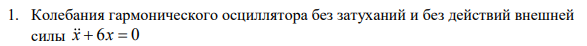
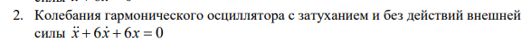
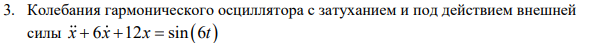
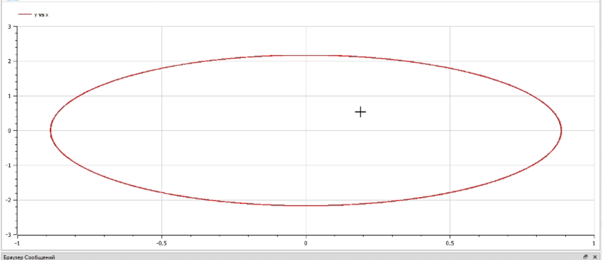
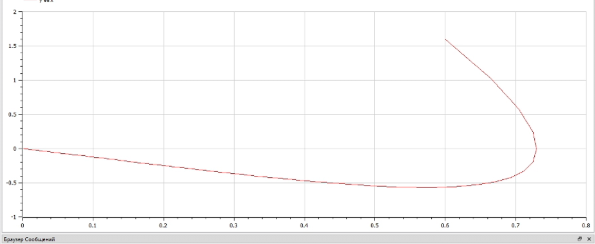
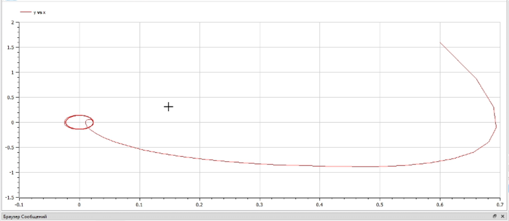

---
## Front matter
lang: ru-RU
title: Презентация к лабораторной работе №4
author: Терентьев Егор Дмитриевич
group: НФИбд-03-19
institute: RUDN University, Moscow, Russian Federation

## Formatting
toc: false
slide_level: 2
theme: metropolis
header-includes:
  - \metroset{progressbar=frametitle,sectionpage=progressbar,numbering=fraction}
  - '\makeatletter'
  - '\beamer@ignorenonframefalse'
  - '\makeatother'
aspectratio: 43
section-titles: true
---

# Презентация к лабораторное работе #4

# Подготовил: Терентьев Егор Дмитриевич

# **Прагматика выполнения лабораторной работы**

- знакомство с моделью гармонических колебаний
- работа с OpenModelica, в свою очередь OpenModelica это бесплатное программное обеспечение для численного моделирования в физической системе. С помощью нее мы можем моделировать, оптимизировать и анализировать сложные физические системы.

# **Цель работы**

Построение модели гармонических колебаний - фазового портрета гармонического осциллятора

# Задачи выполнения лабораторной работы

Построить фазовый портрет гармонического осциллятора и решить уравнения
гармонического осциллятора для следующих случаев:

1. Колебания гармонического осциллятора без затуханий и без действий внешней силы
   
2. Колебания гармонического осциллятора c затуханием и без действий внешней силы
   
3. Колебания гармонического осциллятора c затуханием и под действием внешней силы
   

На интервале t принадлежащему [0; 60](шаг 0.05) с начальными условиями x0=0.6, y0 = 1.6

# **Выполнение лабораторной работы**

**_1 Колебания гармонического осциллятора без затуханий и без действий внешней силы_**

Построил гармонический осциллятора без затуханий и без действий внешней силы в OpenModelica и получил фазовый портрет:

**_2 Колебания гармонического осциллятора c затуханием и без действий внешней силы_**

Построил гармонический осциллятора с затуханий и без действий внешней силы в OpenModelica и получил фазовый портрет:

**_3 Колебания гармонического осциллятора c затуханием и под действием внешней силы_**

Построил гармонический осциллятора с затуханий и под действием внешней силы в OpenModelica и получил фазовый портрет:

# Результаты выполнения лабораторной работы

- три модели в OpenModelica
- графики для трёх моделей

# Выводы

После завершения данной лабораторной работы - я научился выполнять построение модели гармонических колебаний в OpenModelica.
