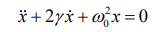
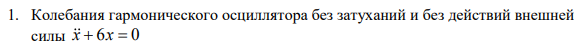
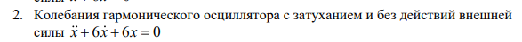
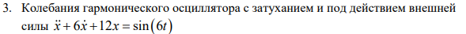
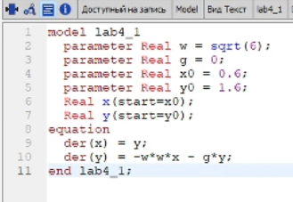
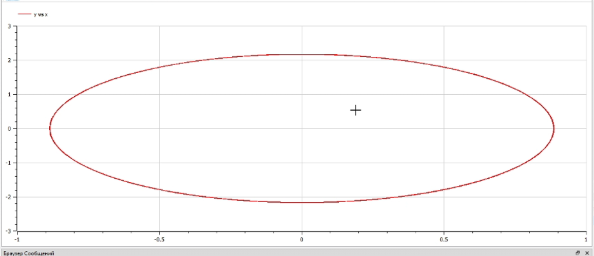
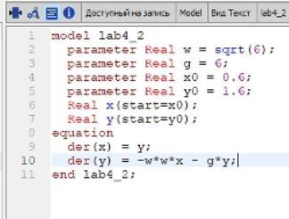
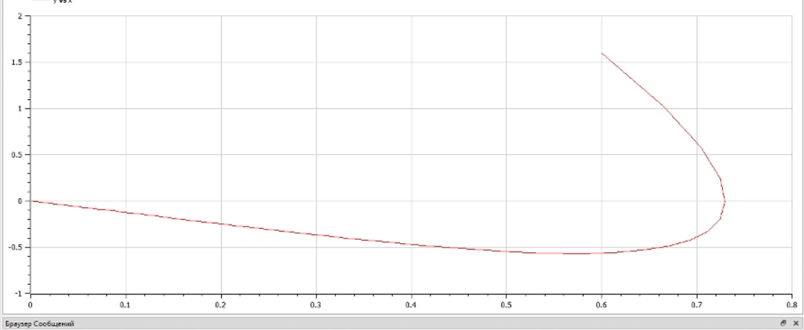
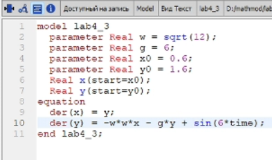
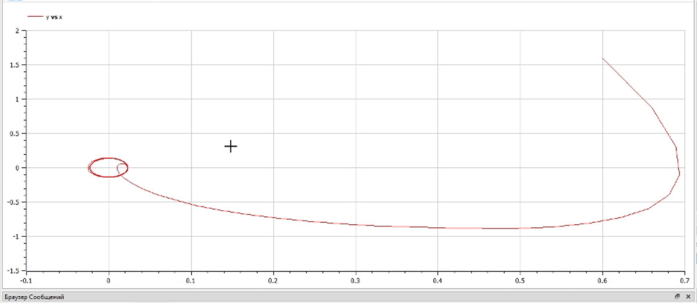

---
# Front matter
title: "Лабораторная работа 4"
author: "Терентьев Егор Дмитриевич"

# Generic otions
lang: ru-RU
toc-title: "Содержание"

# Bibliography
bibliography: bib/cite.bib
csl: pandoc/csl/gost-r-7-0-5-2008-numeric.csl

# Pdf output format
toc: true # Table of contents
toc_depth: 2
lof: true # List of figures
lot: true # List of tables
fontsize: 12pt
linestretch: 1.5
papersize: a4
documentclass: scrreprt
## I18n
polyglossia-lang:
  name: russian
  options:
	- spelling=modern
	- babelshorthands=true
polyglossia-otherlangs:
  name: english
### Fonts
mainfont: PT Serif
romanfont: PT Serif
sansfont: PT Sans
monofont: PT Mono
mainfontoptions: Ligatures=TeX
romanfontoptions: Ligatures=TeX
sansfontoptions: Ligatures=TeX,Scale=MatchLowercase
monofontoptions: Scale=MatchLowercase,Scale=0.9
## Biblatex
biblatex: true
biblio-style: "gost-numeric"
biblatexoptions:
  - parentracker=true
  - backend=biber
  - hyperref=auto
  - language=auto
  - autolang=other*
  - citestyle=gost-numeric
## Misc options
indent: true
header-includes:
  - \linepenalty=10 # the penalty added to the badness of each line within a paragraph (no associated penalty node) Increasing the value makes tex try to have fewer lines in the paragraph.
  - \interlinepenalty=0 # value of the penalty (node) added after each line of a paragraph.
  - \hyphenpenalty=50 # the penalty for line breaking at an automatically inserted hyphen
  - \exhyphenpenalty=50 # the penalty for line breaking at an explicit hyphen
  - \binoppenalty=700 # the penalty for breaking a line at a binary operator
  - \relpenalty=500 # the penalty for breaking a line at a relation
  - \clubpenalty=150 # extra penalty for breaking after first line of a paragraph
  - \widowpenalty=150 # extra penalty for breaking before last line of a paragraph
  - \displaywidowpenalty=50 # extra penalty for breaking before last line before a display math
  - \brokenpenalty=100 # extra penalty for page breaking after a hyphenated line
  - \predisplaypenalty=10000 # penalty for breaking before a display
  - \postdisplaypenalty=0 # penalty for breaking after a display
  - \floatingpenalty = 20000 # penalty for splitting an insertion (can only be split footnote in standard LaTeX)
  - \raggedbottom # or \flushbottom
  - \usepackage{float} # keep figures where there are in the text
  - \floatplacement{figure}{H} # keep figures where there are in the text
---

<h1 align="center">

РОССИЙСКИЙ УНИВЕРСИТЕТ ДРУЖБЫ НАРОДОВ 

Факультет физико-математических и естественных наук  

Кафедра прикладной информатики и теории вероятностей

ОТЧЕТ ПО ЛАБОРАТОРНОЙ РАБОТЕ №4
  
<h2 align="right">

дисциплина: Математическое моделирование

Преподаватель: Кулябов Дмитрий Сергеевич

Студент: Терентьев Егор Дмитриевич

Группа: НФИбд-03-19
  
  
<h1 align="center">

МОСКВА

2022 г.
</h1>

# **Цель работы**

Построение фазового портрета гармонического осциллятора и решение уравнения
гармонического осциллятора.

# **Теоретическое введение**

Движение грузика на пружинке, маятника, заряда в электрическом контуре, а также эволюция во времени многих систем в физике, химии, биологии и других науках при определенных предположениях можно описать одним и тем же дифференциальным уравнением, которое в теории колебаний выступает в качестве основной модели. Эта модель называется линейным гармоническим осциллятором.
Уравнение свободных колебаний гармонического осциллятора имеет следующий вид:

где x – переменная, описывающая состояние системы (смещение грузика, заряд конденсатора и т.д.), гамма – параметр, характеризующий потери энергии (трение в механической системе, сопротивление в контуре), омега0 – собственная частота колебаний, t – время.

Уравнение есть линейное однородное дифференциальное уравнение
второго порядка и оно является примером линейной динамической системы.

# **Условия задачи**

Вариант 36

Постройте фазовый портрет гармонического осциллятора и решение уравнения
гармонического осциллятора для следующих случаев:

1. Колебания гармонического осциллятора без затуханий и без действий внешней силы
   
2. Колебания гармонического осциллятора c затуханием и без действий внешней силы
   
3. Колебания гармонического осциллятора c затуханием и под действием внешней силы
   

На интервале t принадлежащему [0; 60](шаг 0.05) с начальными условиями x0=0.6, y0 = 1.6

# **Выполнение лабораторной работы**

**_1 Колебания гармонического осциллятора без затуханий и без действий внешней силы_**

Построение гармонического осциллятора без затуханий и без действий внешней силы:
Для построение я написал следующий код:

и получил следующий фазовый портрет:

**_2 Колебания гармонического осциллятора c затуханием и без действий внешней силы_**

Построение гармонического осциллятора с затуханий и без действий внешней силы:
Для построение я написал следующий код:

и получил фазовый портрет:

**_3 Колебания гармонического осциллятора c затуханием и под действием внешней силы_**

Построение гармонического осциллятора с затуханий и под действием внешней силы:
Для построение я написал следующий код:

и получил фазовый портрет:

# Выводы

После завершения данной лабораторной работы - я научился выполнять построение модели гармонических колебаний в OpenModelica:

1. фазового портрета гармонического осциллятора без затуханий и без действий внешней силы
2. фазового портрета гармонического осциллятора c затуханием и без действий внешней силы
3. фазового портрета гармонического осциллятора c затуханием и под действием внешней силы

# Список литературы

1. Кулябов, Д.С. - Модель гармонических колебаний
