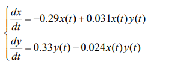
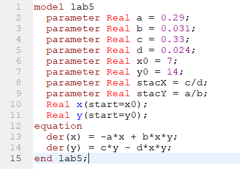
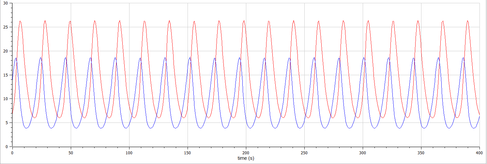
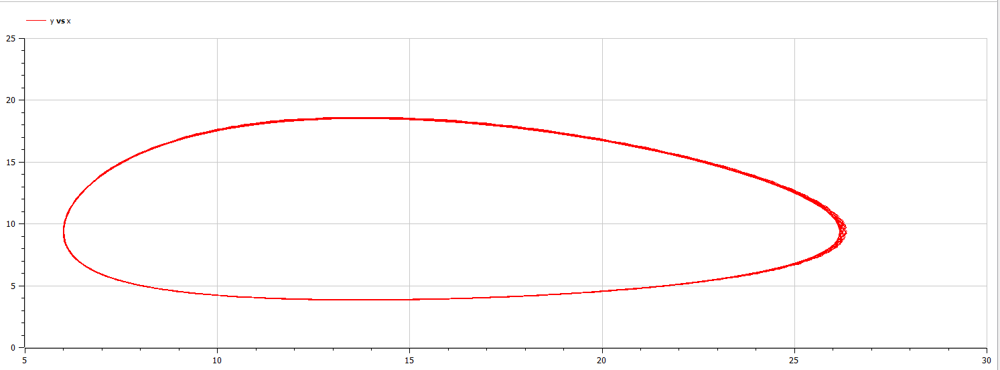

<!-- _class: titleslide -->

#### ПРЕЗЕНТАЦИЯ ПО ЛАБОРАТОРНОЙ РАБОТЕ №5

###### дисциплина: Математическое моделирование

###### Преподователь: Кулябов Дмитрий Сергеевич

###### Студент: Терентьев Егор Дмитриевич

###### Группа: НФИбд-03-19

МОСКВА
2022 г.

---

# **Прагматика выполнения лабораторной работы**

- знакомство с моделью Лотки-Вольтерры "хищник-жертва"
- работа с OpenModelica, в свою очередь OpenModelica это бесплатное программное обеспечение для численного моделирования в физической системе. С помощью нее мы можем моделировать, оптимизировать и анализировать сложные физические системы.

---

# Цель работы

Построение модели взаимодействия двух видов типа «хищник — жертва» - модель Лотки-Вольтерры.

---

# Задачи выполнения лабораторной работы

Для модели «хищник-жертва»:
Пострить график зависимости численности хищников от численности жертв,а также графики изменения численности хищников и численности жертв при следующих начальных условиях: x0 = 7, y0 = 14, а также найти стационарное состояние системы, для данных уравнений:

---

# Выполнение лабораторной работы

**_Построение модели Лотки-Вольтерры "хищник-жертва"_**

Чтобы построить фазовый портрет модели в варианте 35, я написал следующий код:

---

Получил фазовый портрет модели в варианте 35 для обычной системы, зависящей от времени:

---

Фазовый портрет модели в варианте 35 для параметрической системы:

---

Также получил стационарное состояние системы:

---

# Результаты выполнения лабораторной работы

- модель в OpenModelica
- графики для модели

---

# Выводы

## После завершения данной лабораторной работы - я научился выполнять построение модели Лотки-Вольтерры "хищник-жертва" в OpenModelica.
