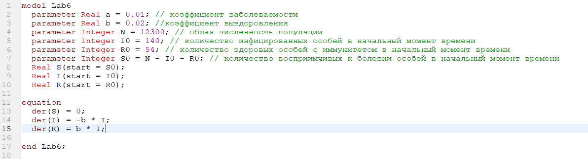
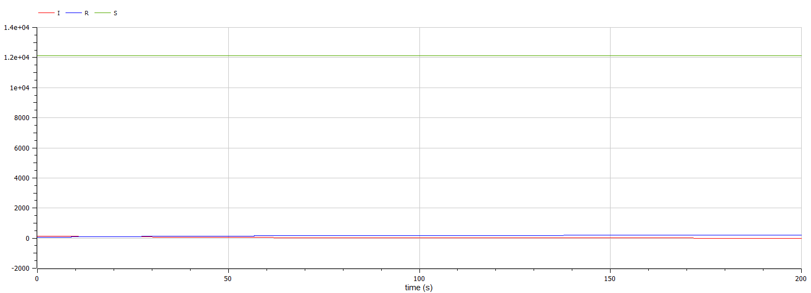
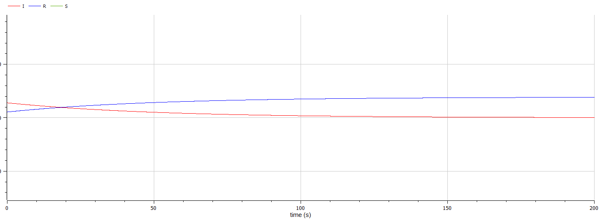
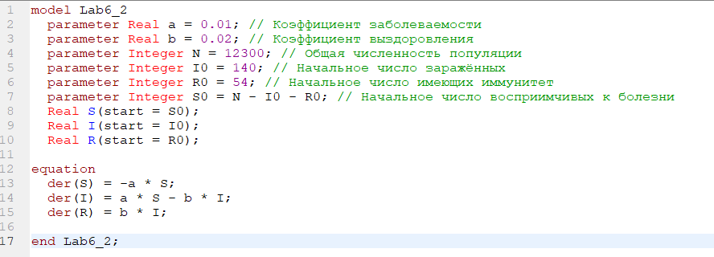
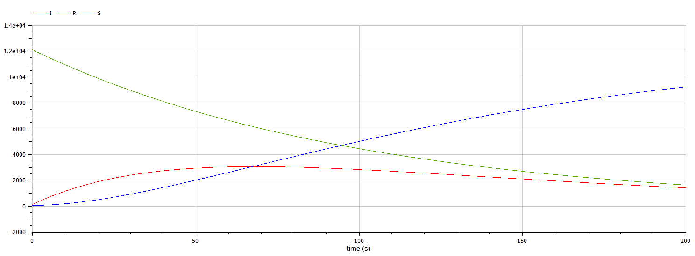

<!-- _class: titleslide -->

РОССИЙСКИЙ УНИВЕРСИТЕТ ДРУЖБЫ НАРОДОВ
Факультет физико-математических и естественных наук  
 Кафедра прикладной информатики и теории вероятностей

## ПРЕЗЕНТАЦИЯ ПО ЛАБОРАТОРНОЙ РАБОТЕ №6

###### дисциплина: Математическое моделирование

###### Преподователь: Кулябов Дмитрий Сергеевич

###### Студент: Терентьев Егор Дмитриевич

###### Группа: НФИбд-03-19

МОСКВА
2022 г.

---

# **Прагматика выполнения лабораторной работы**

- знакомство с моделью эпидемии
- работа с OpenModelica, в свою очередь OpenModelica это бесплатное программное обеспечение для численного моделирования в физической системе. С помощью нее мы можем моделировать, оптимизировать и анализировать сложные физические системы.

---

# **Цель работы**

Построение модели эпидемии

---

# **Задачи выполнения лабораторной работы**

Для модели эпидемии:

На одном острове вспыхнула эпидемия. Известно, что из всех проживающих на острове (N=12 300) в момент начала эпидемии (t=0) число заболевших людей (являющихся распространителями инфекции) I(0)=140, А число здоровых людей с иммунитетом к болезни R(0)=54. Таким образом, число людей восприимчивых к болезни, но пока здоровых, в начальный момент времени S(0)=N-I(0)- R(0). Постройте графики изменения числа особей в каждой из трех групп.
Рассмотрите, как будет протекать эпидемия в случае:

- если I(0) <= I\*

- если I(0) > I\*

---

# **Выполнение лабораторной работы**

**_Построение модели эпидемии_**

Чтобы построить график эпидемии для первого случая, я написал следующий код:

---

И получил следующий график, в случае когда количество заражённых < чем критическая отметка:

---

приближенный график:

---

Чтобы построить график эпидемии для второго случая, я написал следующий код:

---

И получил следующий график, в случае когда количество заражённых > чем критическая отметка:

---

# **Результаты выполнения лабораторной работы**

- модель в OpenModelica
- графики для модели

---

# **Выводы**

После завершения данной лабораторной работы - я научился выполнять построение модели эпидемии в OpenModelica.
