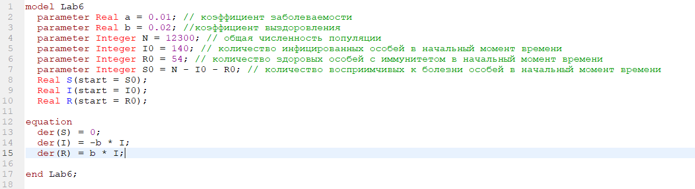
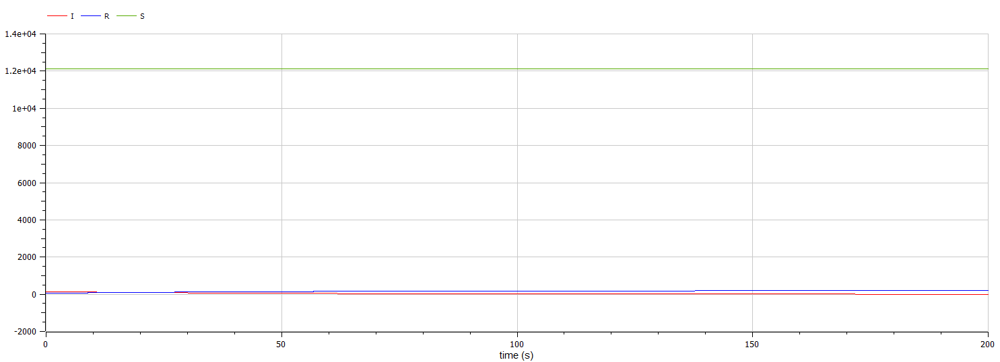
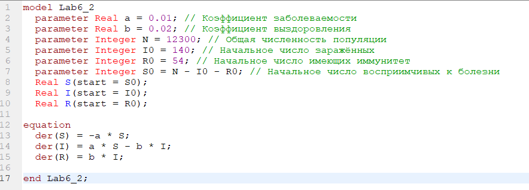
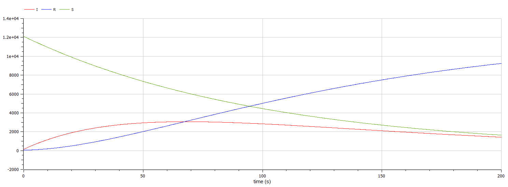

---
# Front matter
title: "Лабораторная работа 6"
author: "Терентьев Егор Дмитриевич, НФИбд-03-19"

# Generic otions
lang: ru-RU
toc-title: "Содержание"

# Bibliography
bibliography: bib/cite.bib
csl: pandoc/csl/gost-r-7-0-5-2008-numeric.csl

# Pdf output format
toc: true # Table of contents
toc_depth: 2
lof: true # List of figures
lot: true # List of tables
fontsize: 12pt
linestretch: 1.5
papersize: a4
documentclass: scrreprt
## I18n
polyglossia-lang:
  name: russian
  options:
	- spelling=modern
	- babelshorthands=true
polyglossia-otherlangs:
  name: english
### Fonts
mainfont: PT Serif
romanfont: PT Serif
sansfont: PT Sans
monofont: PT Mono
mainfontoptions: Ligatures=TeX
romanfontoptions: Ligatures=TeX
sansfontoptions: Ligatures=TeX,Scale=MatchLowercase
monofontoptions: Scale=MatchLowercase,Scale=0.9
## Biblatex
biblatex: true
biblio-style: "gost-numeric"
biblatexoptions:
  - parentracker=true
  - backend=biber
  - hyperref=auto
  - language=auto
  - autolang=other*
  - citestyle=gost-numeric
## Misc options
indent: true
header-includes:
  - \linepenalty=10 # the penalty added to the badness of each line within a paragraph (no associated penalty node) Increasing the value makes tex try to have fewer lines in the paragraph.
  - \interlinepenalty=0 # value of the penalty (node) added after each line of a paragraph.
  - \hyphenpenalty=50 # the penalty for line breaking at an automatically inserted hyphen
  - \exhyphenpenalty=50 # the penalty for line breaking at an explicit hyphen
  - \binoppenalty=700 # the penalty for breaking a line at a binary operator
  - \relpenalty=500 # the penalty for breaking a line at a relation
  - \clubpenalty=150 # extra penalty for breaking after first line of a paragraph
  - \widowpenalty=150 # extra penalty for breaking before last line of a paragraph
  - \displaywidowpenalty=50 # extra penalty for breaking before last line before a display math
  - \brokenpenalty=100 # extra penalty for page breaking after a hyphenated line
  - \predisplaypenalty=10000 # penalty for breaking before a display
  - \postdisplaypenalty=0 # penalty for breaking after a display
  - \floatingpenalty = 20000 # penalty for splitting an insertion (can only be split footnote in standard LaTeX)
  - \raggedbottom # or \flushbottom
  - \usepackage{float} # keep figures where there are in the text
  - \floatplacement{figure}{H} # keep figures where there are in the text
---

<h1 align="center">

РОССИЙСКИЙ УНИВЕРСИТЕТ ДРУЖБЫ НАРОДОВ 

Факультет физико-математических и естественных наук  

Кафедра прикладной информатики и теории вероятностей

ОТЧЕТ ПО ЛАБОРАТОРНОЙ РАБОТЕ №6
  
<h2 align="right">

дисциплина: Математическое моделирование

Преподователь: Кулябов Дмитрий Сергеевич

Студент: Терентьев Егор Дмитриевич

Группа: НФИбд-03-19
  
  
<h1 align="center">

МОСКВА

2022 г.
</h1>

# **Цель работы**

Построение простейшей модель эпидемии.

# **Теоретическое введение**

У нас есть некая популяция состоящая из N особей, (считаем, что популяция изолирована) подразделяется на три группы. Первая группа - это восприимчивые к болезни, но пока здоровые особи, обозначим их через S(t). Вторая группа – это число инфицированных особей, которые также при этом являются распространителями инфекции, обозначим их I(t). А третья группа, обозначающаяся через R(t) – это здоровые особи с иммунитетом к болезни.
До того, как число заболевших не превышает критического значения I* считаем, что все больные изолированы и не заражают здоровых. Когда I(t) > I* тогда инфицирование способны заражать восприимчивых к болезни особей.
Таким образом, скорость изменения числа S(t) меняется по следующему закону:
производная по S = -a\*S, если I(t)>I\* или 0,если I(t)<=I\*
Поскольку каждая восприимчивая к болезни особь, которая, в конце концов, заболевает, сама становится инфекционной, то скорость изменения числа инфекционных особей представляет разность за единицу времени между заразившимися и теми, кто уже болеет и лечится, т.е.:
производная по I = -a\*S - b\*I, если I(t)>I\* или -b\*I,если I(t)<=I\*
А скорость изменения выздоравливающих особей (при этом приобретающие иммунитет к болезни):
производная по R = b\*I
Постоянные пропорциональности a,b - это коэффициенты заболеваемости и выздоровления соответственно.

# **Условия задачи**

_Вариант 35_

На одном острове вспыхнула эпидемия. Известно, что из всех проживающих на острове (N=12 300) в момент начала эпидемии (t=0) число заболевших людей (являющихся распространителями инфекции) I(0)=140, А число здоровых людей с иммунитетом к болезни R(0)=54. Таким образом, число людей восприимчивых к болезни, но пока здоровых, в начальный момент времени S(0)=N-I(0)- R(0). Постройте графики изменения числа особей в каждой из трех групп.
Рассмотрите, как будет протекать эпидемия в случае:

- 1. если I(0) <= I\*
- 2. если I(0) > I\*

# **Выполнение лабораторной работы**

**_Построение модели об эпидемии_**

Чтобы построить график для случая I(0) <= I\*, я написал следующий код (Рис [-@fig:001]):

{ #fig:001 width=90% }

и получил следующий график (Рис [-@fig:002] и [-@fig:003]):

{#fig:002 width=90%}

{#fig:003 width=90%}

Чтобы построить график для случая I(0) > I\*, я написал следующий код (Рис [-@fig:004]):

{ #fig:004 width=90% }

и получил следующий график (Рис [-@fig:005]):

{#fig:005 width=90%}

# Выводы

После завершения данной лабораторной работы - я научился выполнять построение модели эпидемии в OpenModelica.

# Список литературы

1. Лабораторная работа №5. Задача об эпидемии. - [Электронный ресурс]. М. URL: [Лабораторная работа №6. Задача об эпидемии.](https://esystem.rudn.ru/pluginfile.php/1343893/mod_resource/content/2/Лабораторная%20работа%20№%204.pdf) (Дата обращения: 18.03.2021).
