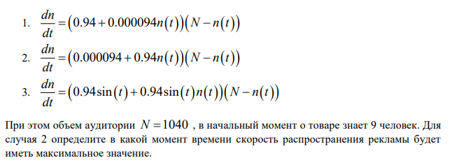
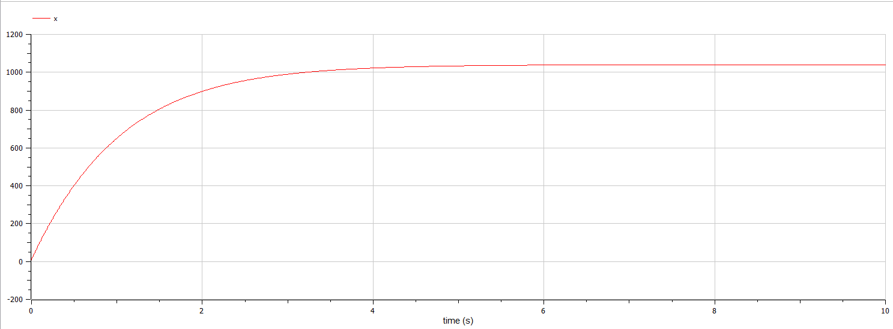
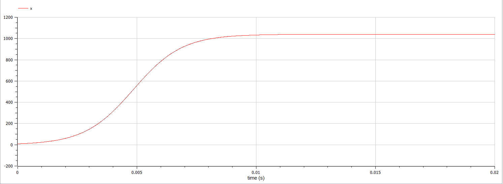

---
# Front matter
title: "Лабораторная работа 7"
author: "Терентьев Егор Дмитриевич, НФИбд-03-19"

# Generic otions
lang: ru-RU
toc-title: "Содержание"

# Bibliography
bibliography: bib/cite.bib
csl: pandoc/csl/gost-r-7-0-5-2008-numeric.csl

# Pdf output format
toc: true # Table of contents
toc_depth: 2
lof: true # List of figures
lot: true # List of tables
fontsize: 12pt
linestretch: 1.5
papersize: a4
documentclass: scrreprt
## I18n
polyglossia-lang:
  name: russian
  options:
	- spelling=modern
	- babelshorthands=true
polyglossia-otherlangs:
  name: english
### Fonts
mainfont: PT Serif
romanfont: PT Serif
sansfont: PT Sans
monofont: PT Mono
mainfontoptions: Ligatures=TeX
romanfontoptions: Ligatures=TeX
sansfontoptions: Ligatures=TeX,Scale=MatchLowercase
monofontoptions: Scale=MatchLowercase,Scale=0.9
## Biblatex
biblatex: true
biblio-style: "gost-numeric"
biblatexoptions:
  - parentracker=true
  - backend=biber
  - hyperref=auto
  - language=auto
  - autolang=other*
  - citestyle=gost-numeric
## Misc options
indent: true
header-includes:
  - \linepenalty=10 # the penalty added to the badness of each line within a paragraph (no associated penalty node) Increasing the value makes tex try to have fewer lines in the paragraph.
  - \interlinepenalty=0 # value of the penalty (node) added after each line of a paragraph.
  - \hyphenpenalty=50 # the penalty for line breaking at an automatically inserted hyphen
  - \exhyphenpenalty=50 # the penalty for line breaking at an explicit hyphen
  - \binoppenalty=700 # the penalty for breaking a line at a binary operator
  - \relpenalty=500 # the penalty for breaking a line at a relation
  - \clubpenalty=150 # extra penalty for breaking after first line of a paragraph
  - \widowpenalty=150 # extra penalty for breaking before last line of a paragraph
  - \displaywidowpenalty=50 # extra penalty for breaking before last line before a display math
  - \brokenpenalty=100 # extra penalty for page breaking after a hyphenated line
  - \predisplaypenalty=10000 # penalty for breaking before a display
  - \postdisplaypenalty=0 # penalty for breaking after a display
  - \floatingpenalty = 20000 # penalty for splitting an insertion (can only be split footnote in standard LaTeX)
  - \raggedbottom # or \flushbottom
  - \usepackage{float} # keep figures where there are in the text
  - \floatplacement{figure}{H} # keep figures where there are in the text
---

<h1 align="center">

РОССИЙСКИЙ УНИВЕРСИТЕТ ДРУЖБЫ НАРОДОВ 

Факультет физико-математических и естественных наук  

Кафедра прикладной информатики и теории вероятностей

ОТЧЕТ ПО ЛАБОРАТОРНОЙ РАБОТЕ №7
  
<h2 align="right">

дисциплина: Математическое моделирование

Преподователь: Кулябов Дмитрий Сергеевич

Студент: Терентьев Егор Дмитриевич

Группа: НФИбд-03-19
  
  
<h1 align="center">

МОСКВА

2022 г.
</h1>

# **Цель работы**

Построение модели эффективности рекламы.

# **Теоретическое введение**

Предположим, что торговыми учреждениями реализуется некоторая продукция, о которой в момент времени t из числа потенциальных покупателей N знает лишь n покупателей. Для ускорения сбыта продукции запускается реклама по радио, телевидению и других средств массовой информации. После запуска рекламной кампании информация о продукции начнет распространяться среди потенциальных покупателей путем общения друг с другом. Таким образом, после запуска рекламных объявлений скорость изменения числа знающих о продукции людей пропорциональна как числу знающих о товаре покупателей, так и числу покупателей о нем не знающих.

Математическая модель распространения рекламы описывается уравнением:

- где dn/dt - скорость изменения со временем числа потребителей, узнавших о товаре и готовых его купить, t - время, прошедшее с начала рекламной кампании,
- n(t) - число уже информированных клиентов, N - общее число потенциальных платежеспособных покупателей,
- а1(t) > 0 - характеризует интенсивность рекламной кампании (зависит от затрат на рекламу в данный момент времени).

Помимо этого, узнавшие о товаре потребители также распространяют полученную
информацию среди потенциальных покупателей, не знающих о нем (в этом случае работает т.н. сарафанное радио). Этот вклад в рекламу описывается величиной а2(t)n(t)(N-n(t)).

При a1(t) >= a2(t) получается модель типа модели Мальтуса.В обратном случае, получаем уравнение логистической
кривой.

# **Условия задачи**

_Вариант 36_

Постройте график распространения рекламы, математическая модель которой описывается следующим уравнением:

При этом объем аудитории N = 1040, в начальный момент о товаре знает 9 человек. Для случая 2 определите в какой момент времени скорость распространения рекламы будет
иметь максимальное значение.

# **Выполнение лабораторной работы**

**_Построение модели эффективности рекламы_**

Чтобы построить график распространения информации о товаре с учетом платной рекламы и с учетом сарафанного радио для первого уравнения, я написал следующий код:

и получил график:

Чтобы построить график распространения информации о товаре с учетом платной рекламы и с учетом сарафанного радио для второго уравнения, я написал следующий код:

и получил график:

а также определил в какой момент времени скорость распространения рекламы будет
иметь максимальное значение: 0.00485s

Чтобы построить график распространения информации о товаре с учетом платной рекламы и с учетом сарафанного радио для третьего уравнения, я написал следующий код:

и получил график:

# Выводы

После завершения данной лабораторной работы я научился выполнять построение модели распространения информации о товаре с учетом платной рекламы и с учетом сарафанного радио в OpenModelica.

# Список литературы

1. Кулябов, Д.С. - Эффективность рекламы
