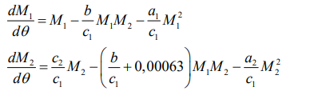
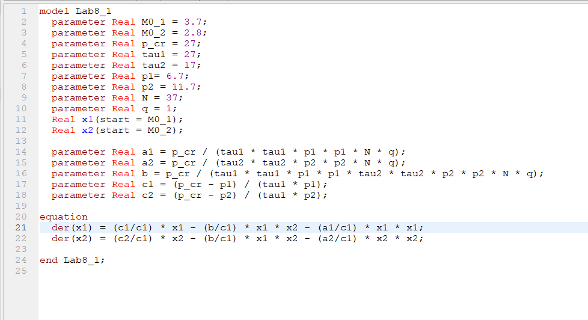
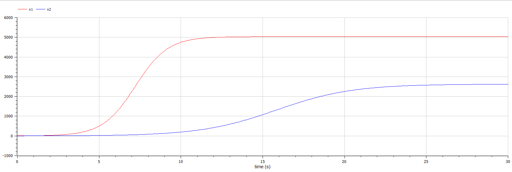
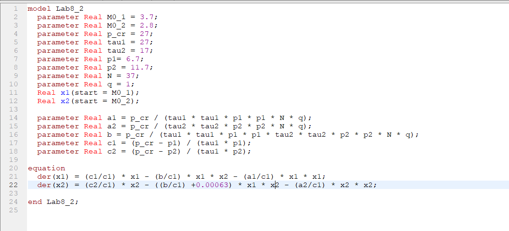
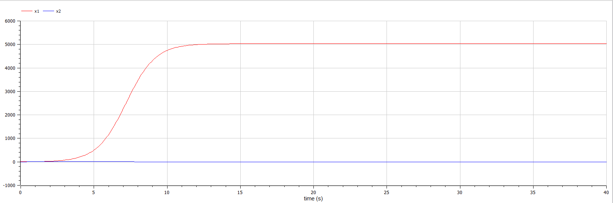
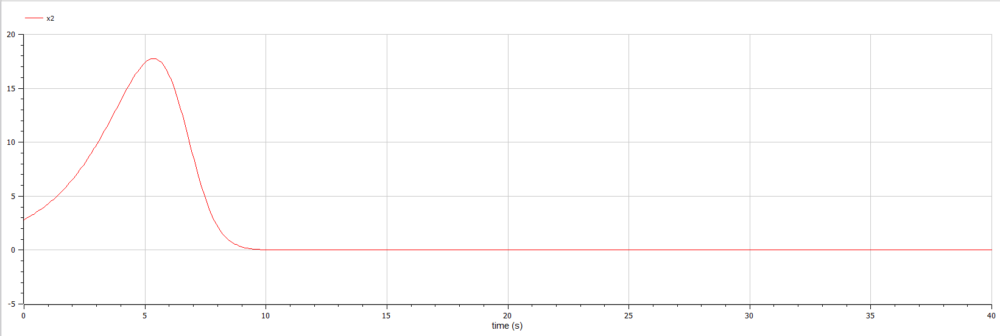

<!-- _class: titleslide -->

РОССИЙСКИЙ УНИВЕРСИТЕТ ДРУЖБЫ НАРОДОВ
Факультет физико-математических и естественных наук  
 Кафедра прикладной информатики и теории вероятностей

## ПРЕЗЕНТАЦИЯ ПО ЛАБОРАТОРНОЙ РАБОТЕ №8

###### дисциплина: Математическое моделирование

###### Преподователь: Кулябов Дмитрий Сергеевич

###### Студент: Терентьев Егор Дмитриевич

###### Группа: НФИбд-03-19

МОСКВА
2022 г.

---

# Прагматика выполнения лабораторной работы

- знакомство с моделью конкуренции двух фирм
- работа с OpenModelica, в свою очередь OpenModelica это бесплатное программное обеспечение для численного моделирования в физической системе. С помощью нее мы можем моделировать, оптимизировать и анализировать сложные физические системы.

---

# Цель работы

построение модели конкуренции двух фирм

---

# Задачи выполнения лабораторной работы

1. Постройте графики изменения оборотных средств фирмы 1 и фирмы 2 без учета постоянных издержек и с веденной нормировкой для случая 1.

2. Постройте графики изменения оборотных средств фирмы 1 и фирмы 2 без учета постоянных издержек и с веденной нормировкой для случая 2.

---

# Выполнение лабораторной работы

**_Построение модели эффективности рекламы_**

Уравнения для модели варианта 36:

Чтобы построить графики изменения оборотных средств фирмы 1 и фирмы 2 без учета постоянных издержек и с веденной нормировкой для случая 1 я написал следующий код:

---

и получил график:

---

Чтобы построить графики изменения оборотных средств фирмы 1 и фирмы 2 без учета постоянных издержек и с веденной нормировкой для случая 2 я написал следующий код:

---

и получил график:

---

А также увеличенный график фирмы 2

---

# Выводы

После завершения данной лабораторной работы я научился выполнять построение графиков изменения оборотных средств фирмы 1 и фирмы 2 без учета постоянных издержек и с веденной нормировкой в OpenModelica.
